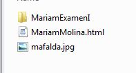

# Mariam_PrimerExamen
Hola Profe
En el .rar que esta aqui Mariam Molina Progra3 Examen1.rar usted va a encontrar:

El folder MariamExamenI  tiene el programa en c# de los ejercicio 2 y 3 (el de la suma de diagonales y el camelCase)

Tambien incluye un MariamMolina.html que es el ejercicio 1. 
Este tambien incluye una imagen mafalda.jpg que es usada en el ejercicio 1 por lo que debe estar siempre en la misma carpeta
donde vaya a correr el archivo.html 

